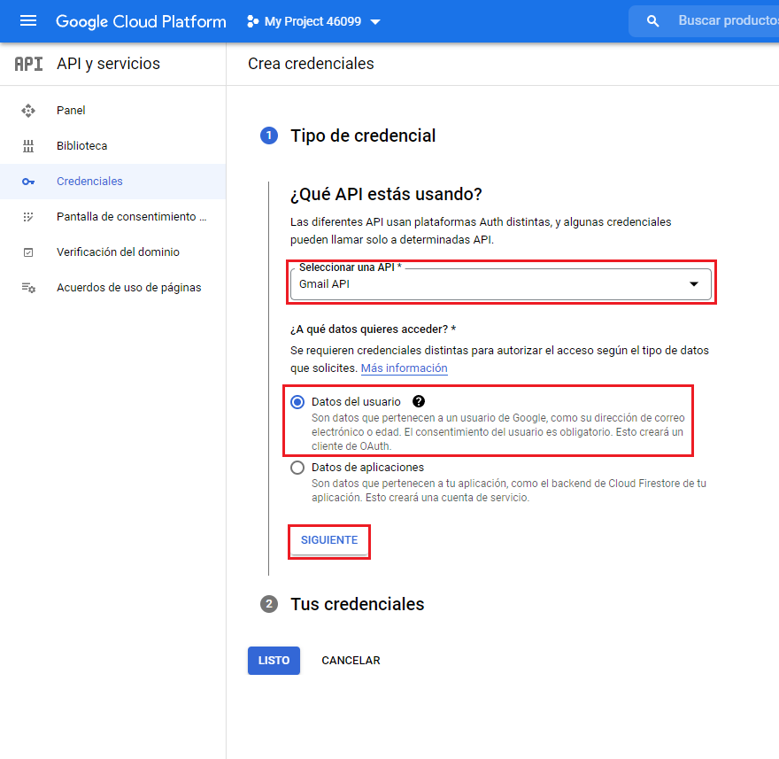

# Gmail G Suite

Module to make actions with Gmail

# How to install this module
**Download** and **install** the content in the folder "modules" in Rocketbot's path.

# How to use
## Obtaining credentials:
To work with this module it is necessary to activate the gmail API. For this, you must follow the following steps.
* Go to [Google console](https://console.cloud.google.com/projectcreate?previousPage=%2Fhome%2Fdashboard%3Fproject%3Dprueba-312216%26hl%3Des&folder=&organizationId=777182023349&hl=es) to create a new project (If you already have one created, skip this step) and complete the information indicated in the form

In the top bar you will see the name of the project. If it is not displayed, change to the created project by clicking on the in the menu that is highlighted in the image.

If you get the message "You do not have sufficient permissions to view this page." As shown in the image above, click on **API and Services** on the left panel, and after switching to the page, click on **ENABLE API AND SERVICES**

Within the browser "Search APIs and services" type **Gmail API**. Then, enable the API by clicking on **Enable**

It will take a moment to load and the page will redirect to the API settings page.

* Click on **CREATE CREDENTIALS**, to create the credentials

The first step is to select the type of credential. We select **Gmail API** and check the option **User data**. Then click next.

On the consent screen, type a name for the app and select an email.

On the permissions screen, click **ADD OR REMOVE PERMISSIONS**. A modal will open to select the permissions. In the filter type **Gmail API**, click on the dropdown menu **Rows per page** and select **100** to see all the options, select all by checking **API**, then click on * *Update**

Once the selected permissions are added, click on **SAVE AND CONTINUE**

Finally, on the OAuth screen, select the application type **Desktop APP**, and add a name. We finish by clicking on create.

It will create the credentials for us, we click on download and then on ready. It is important to keep the file downloaded. It will be used later in the module.

In the menu on the left, when you click on **Consent screen**, if you have a corporate gmail account, you will be able to use the API indefinitely and you will see that the type of user is **Internal**. If you have a free gmail account, you will have to give consent once a week to be able to connect to your email account and you will see that your user type is **External** and you will have to add test users.

To prevent committing every week, you can publish the app for google approval and you can use it indefinitely.

## Overview

1. Server Configuration  
Configure the mail server to be used

2. Send Email  
Send email, before you must configurate the server

3. List all email  
List all email, you can specify a filter

4. List unread emails  
List unread emails, you can specify a filter

5. Read email for ID  
You can specify the ID of an email to read it

6. Create Label  
You can create a label with the name you want

7. Move email to label  
Move email from one label to another

8. Mark email as unread  
Any previously opened email can be marked as unread

9. Close Server  
Close server connection

10. List all labels  
Get a list of all mail labels and store them in a variable

11. Forward  
Forward an email

12. Download attachments for ID  
Downloads email attachments and saves them in a folder  

----
### OS

- windows
- mac
- linux
- docker

### Dependencies
- [**mail-parser**](https://pypi.org/project/mail-parser/)
### License
  
  
[MIT](http://opensource.org/licenses/mit-license.ph)
