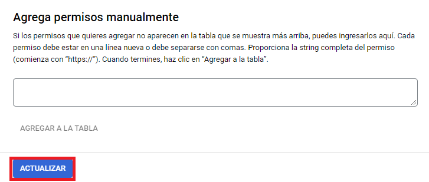
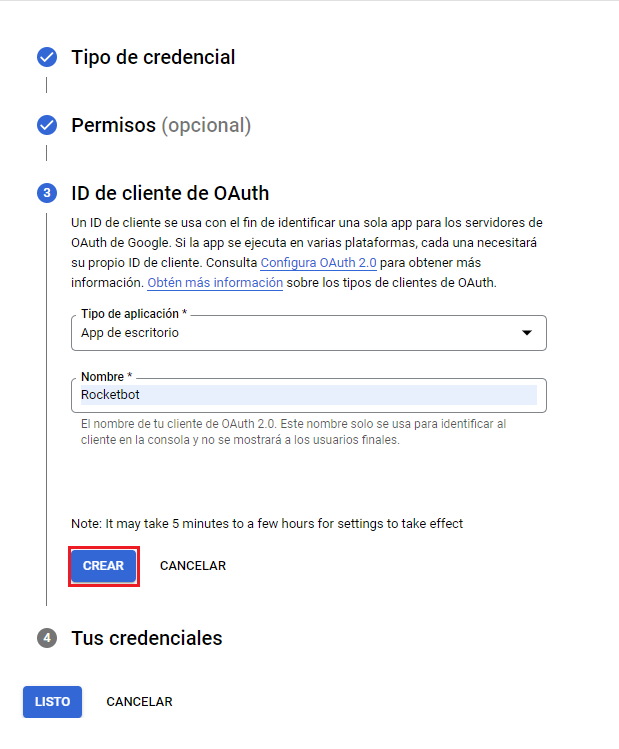
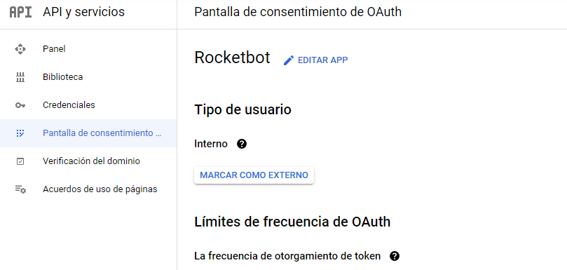
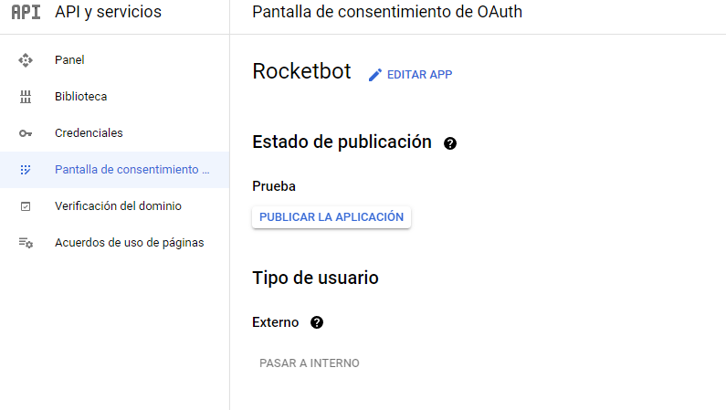

# Gmail G Suite
  
Módulo para realizar acciones en Gmail  

# Cómo instalar este módulo
**Descargar** e **instala** el contenido en la carpeta "modules" en la ruta de RocketBot.

# Cómo usar este módulo
Para trabajar con este módulo es necesario activar la API de gmail. Para esto, debes seguir los 
siguientes pasos.
* Ir a [Consola de 
Google](https://console.cloud.google.com/projectcreate?previousPage=%2Fhome%2Fdashboard%3Fproject%3Dprueba-312216%26hl%3Des&folder=&organizationId=777182023349&hl=es)
 para crear un nuevo proyecto (Si ya tienes uno creado, omita este paso) y complete los datos indicados en el formulario

En la barra superior verás el nombre del proyecto. Si no se visualiza, cambie al proyecto
 creado haciendo click en la en el menu que se encuentra remarcado en la imagen.

Si 
tienes el mensaje "No cuentas con los permisos suficientes para ver esta página." como se muestra en la imagen anterior,
 de click en **API y Servicios** del panel izquierdo, y luego de cambiar a la página, hacer click en **HABILITAR API Y 
SERVICIOS**

Dentro del buscador "Buscar API y servicios" escriba **Gmail API**. 
Luego, habilitar la API dando click en **Habilitar**

Tardará un momento en cargar y la página 
redireccionará a la página de configuración de la API.

* Haga click en **CREAR CREDENCIALES**, para crear las 
credenciales

El primer paso es seleccionar el tipo de credencial. Seleccionamos 
**Gmail API** y tildamos la opción **Datos del usuario**. A continuación haga click en siguiente.

En la pantalla de consentimiento, escribir un nombre para la aplicación y seleccionar un 
correo electrónico.

En la pantalla de permisos, haga click en **AGREGAR O QUITAR 
PERMISOS**. Se abrirá un modal para seleccionar los permisos. En el filtro escriba **Gmail API**, click en el menu 
desplegable **Filas por pagina** y seleccione **100** para poder ver todas las opciones, seleccione todas tildando 
**API**, luego click en **Actualizar**.

Una vez se agreguen 
los permisos seleccionados, da click en **GUARDAR Y CONTINUAR**

Finalmente, en la 
pantalla de OAuth, seleccionar el tipo de aplicación **APP de escritorio**, y agregar un nombre. Finalizamos dando click
 en crear.

Nos creará las credenciales, damos click en descargar y luego en listo. Es importante 
mantener el archivo descargado. Se utilizará más adelante en el módulo.

En el menú de la 
izquierda, al dar click en **Pantalla de consentimiento**, si tienes una cuenta corporativa de gmail, podrás utilizar la
 API indefinidamente y verás que el tipo de usuario es **Interno**. Si cuentas con una cuenta gmail gratuita, tendrás 
que dar el consentimiento una vez a la semana para poder conectarte a tu cuenta de correo y verás que tu tipo de usuario
 es **Externo** y deberás agregar usuarios de prueba.

Para prevenir 
confirmar cada semana, puedes publicar la aplicación para que google la apruebe y puedas usarla indefinidamente.

## Overview

1. Server Configuration  
Configure the mail server to be used

2. Send Email  
Send email, before you must configurate the server

3. List all email  
List all email, you can specify a filter

4. List unread emails  
List unread emails, you can specify a filter

5. Read email for ID  
You can specify the ID of an email to read it

6. Create Label  
You can create a label with the name you want

7. Move email to label  
Move email from one label to another

8. Mark email as unread  
Any previously opened email can be marked as unread

9. Close Server  
Close server connection

10. List all labels  
Get a list of all mail labels and store them in a variable

11. Forward  
Forward an email

12. Download attachments for ID  
Downloads email attachments and saves them in a folder  

----
### OS

- windows
- mac
- linux
- docker

### Dependencies
- [**mail-parser**](https://pypi.org/project/mail-parser/)
### License
  
  
[MIT](http://opensource.org/licenses/mit-license.ph)
